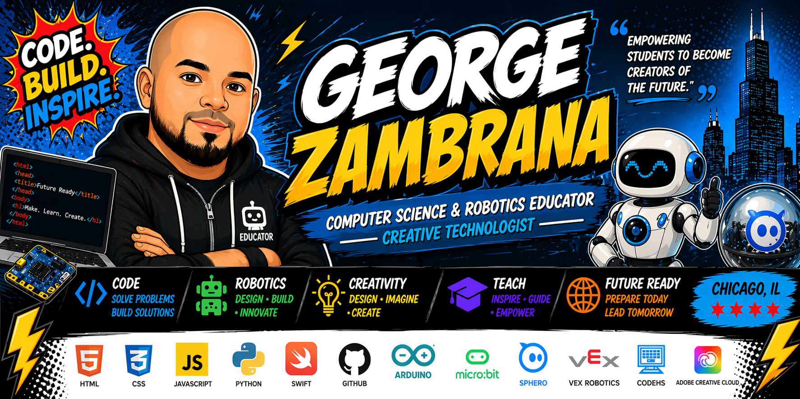

  

<h1 align="center">George Zambrana</h1>
<h3 align="center">High School Computer Science & Robotics Educator | Creative Technologist</h3>

  
  
  
  

---

## 👋 Hello there...
Here's a little bit about me 👇

🎓 High School Computer Science & Robotics Educator  
🎨 Creative Technologist  

---

## 🚀 About Me  
I’m a passionate Computer Science teacher in Chicago focused on making tech engaging and accessible.

- 🏫 Teaching CS & Robotics  
- 🎮 Inspired by gaming + comic culture  
- 🌍 Bilingual learning  
- 🎨 Background in graphic design  

---

## 💻 What I’m Working On  
- 🥁 Drum Box App  
- 🤖 Robotics Projects  
- 🌐 Student Websites  

---

## 🛠️ Tech & Tools  

  

---

## 🎯 Teaching Philosophy  
> Learning should feel like building something powerful 🚀  

---

## 📊 GitHub Activity
<!-- Stats temporarily removed due to API instability -->

---

## 📫 Connect  
📍 Chicago, IL  